## Creacion de cuenta GitHub

Crear una cuenta en GitHub es un proceso simple y directo. Sigue estos pasos para registrarte:

1. **Abre el Sitio de GitHub**
    
    - Ve a la pagina principal de Github: [https://github.com/](https://github.com/)

2. **Inicia el Proceso de Registro**

    - En la página principal, haz clic en el botón **"Sign up"** (Registrarse) o en **"Sign up for GitHub"**.

    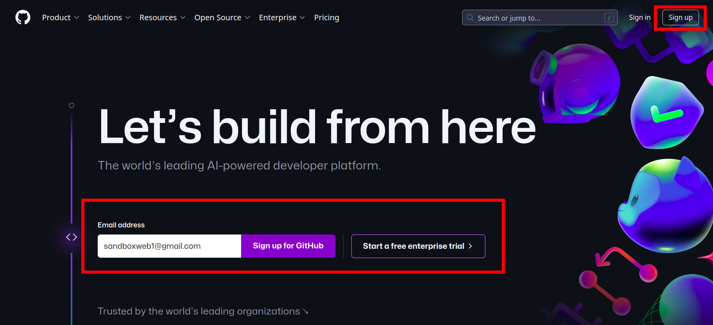

3. **Completa el Formulario de Registro**

    Se te pedirá que completes algunos campos para crear tu cuenta:

    - **Correo Electronico:** ngresa tu dirección de correo electrónico.

    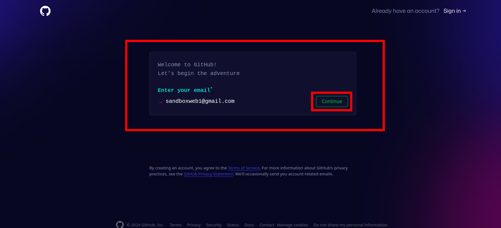

    - **Contraseña:** Crea una contraseña segura. Debe ser lo suficientemente fuerte para proteger tu cuenta.

    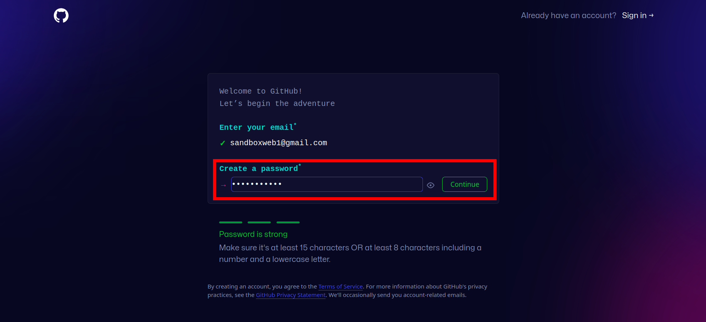

    - **Nombre de Usuario:** Escoge un nombre de usuario que sea único. Este nombre de usuario será tu identificador en GitHub y será visible para otros usuarios.

    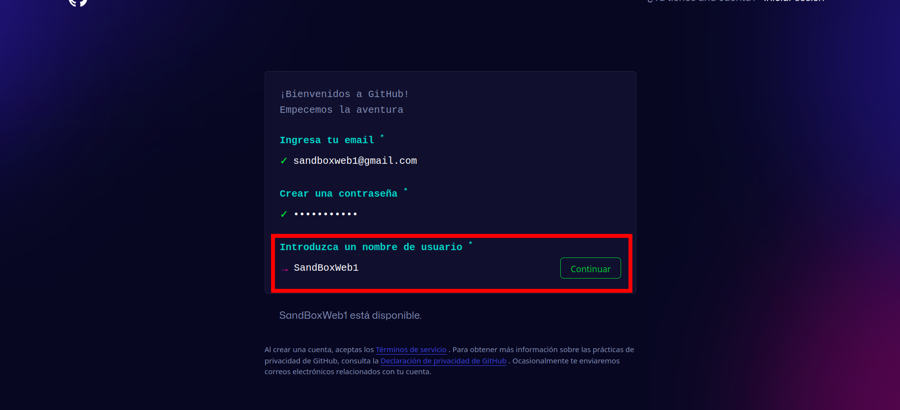

    **Nota:** El nombre de usuario sólo puede contener caracteres alfanuméricos o guiones simples, y no puede comenzar ni terminar con un guión.

    - **¿Deseas recibir actualizaciones de GitHub?:** Puedes seleccionar si deseas recibir noticias y actualizaciones de GitHub por correo electrónico.

    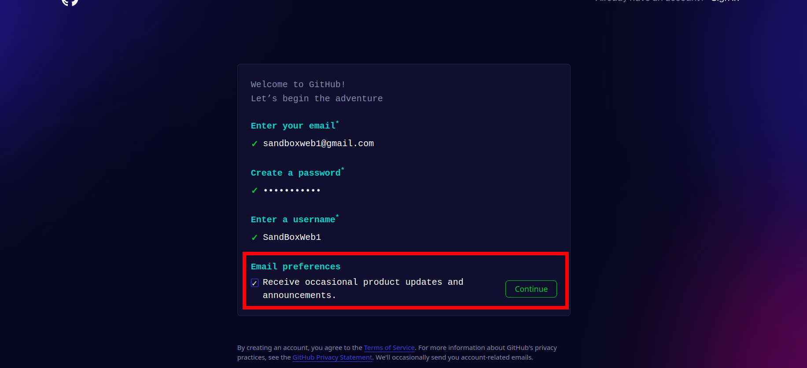

    Esperamos un momento (esperanding*):

    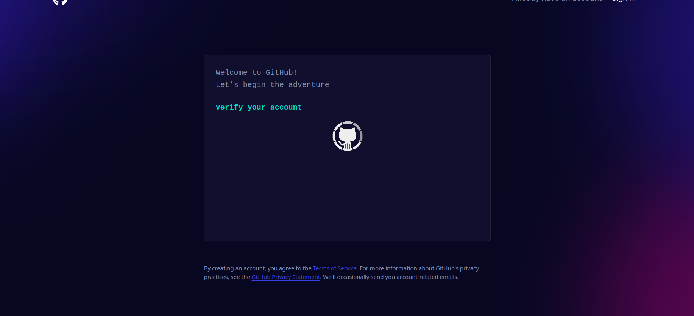

    - **Captcha:** GitHub podría solicitarte que completes un captcha para verificar que no eres un bot.

    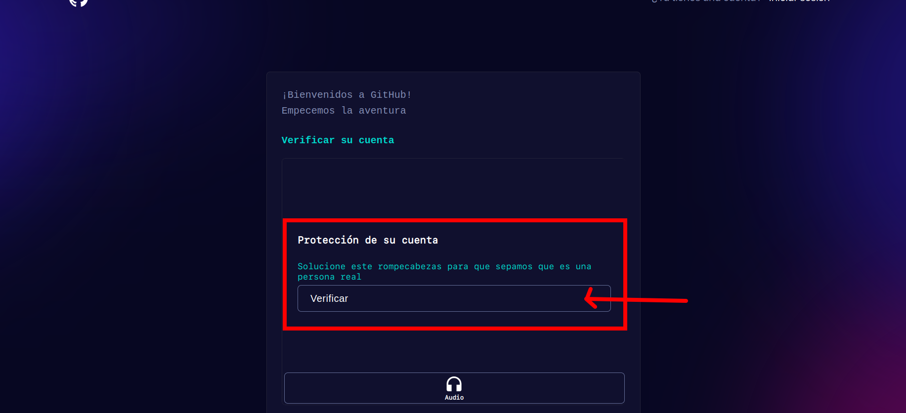

    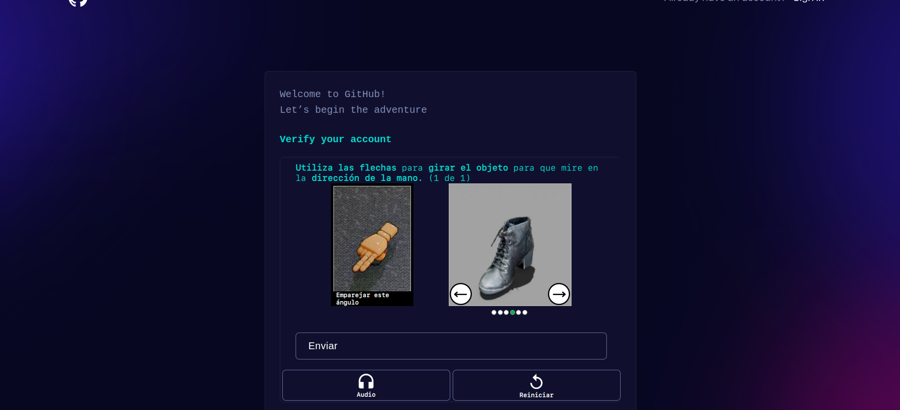

    - **Nota:** No puedes poner como contrasena tu nombre de ususario, te pedira una correpcion

    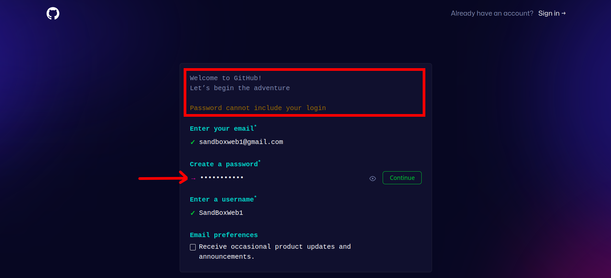

4. **Continuar con la Configuración de la Cuenta**

    - Haz clic en "Create account" (Crear cuenta) para continuar.

    - GitHub te pedirá que verifiques tu correo electrónico. Ve a la bandeja de entrada de tu correo y busca un mensaje de verificación de GitHub. Sigue el enlace que contiene para verificar tu cuenta.

    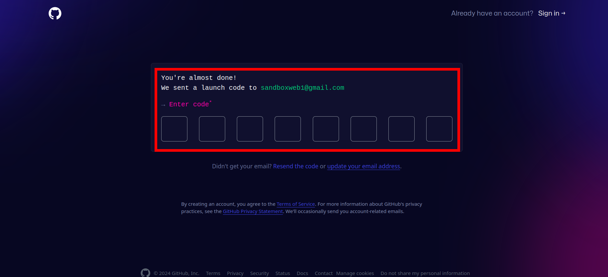

5. **Cuenta Creada:** Ahora ya tienes una cuenta en Github!!!

    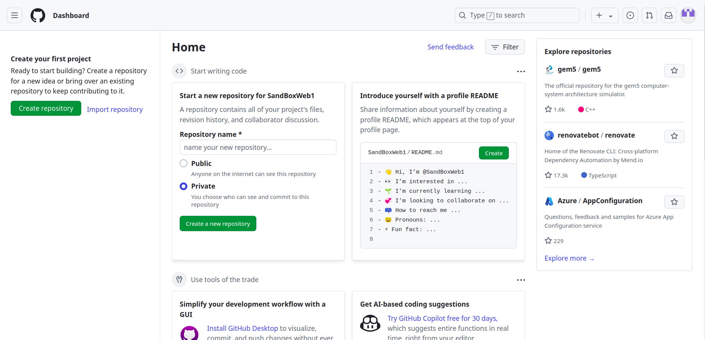

Ahora que ya tienes tu cuenta de GitHub puedes:

- Crear un nuevo repositorio

- Personalizar tu cuenta

- Colaborar en un proyecto 

- Seguir a un amigo o alguien que tenga proyectos geniales!!!