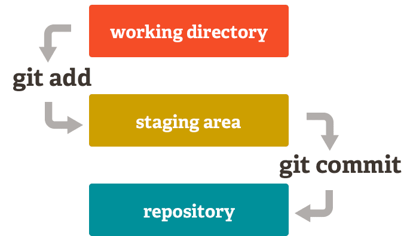
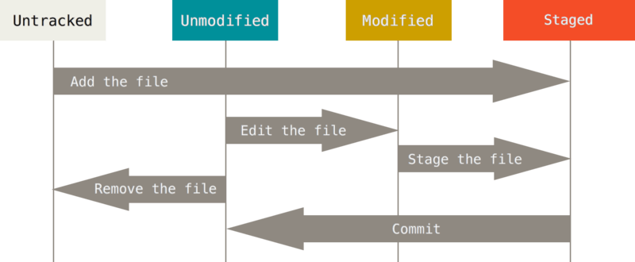

### 2. Conceptos Básicos de Git

#### 2.1. Creacion de un repositorio

Para Git un **repositorio** es una estructura que permite r**astrear el historial** de cada cambio en tu proyecto, permitiendo ver qué se ha modificado, quién lo hizo y cuándo. Esto es útil no solo para trabajar de manera individual, sino también para colaborar en equipo.

1. **Inicializar un repositorio:** Imagina que tienes una carpeta llamada proyecto. Vamos a inicializarla como un repositorio Git.

   ```bash
   cd proyecto
   git init
   ```

Este comando creara una carpeta oculta llamada `.git` donde se almacenara todo el historial, inicializando un Repositorio Git, que rastreara todos los archivos y carpetas que esten dentro de la carpeta "proyecto".

#### 2.2. Estados de Git: Directorio de Trabajo, Área de Preparación y Repositorio

Para manejar Git eficazmente, es fundamental comprender los tres estados principales por los que pasan los archivos en un repositorio Git: **Directorio de Trabajo (Working Directory)**, **Área de Preparación (Staging Area o Index)** y **Repositorio (Committed State)**. Estos estados definen cómo Git rastrea y maneja los cambios en tus archivos.



**2.2.1. El Directorio de Trabajo (Working Directory)**

El **Directorio de Trabajo** es el conjunto de archivos y carpetas que ves en tu sistema de archivos local. Cuando clonas un repositorio o inicializas uno nuevo, Git crea una copia del proyecto en tu máquina. Aquí es donde editas, agregas o eliminas archivos.

- **Estado de los archivos**:

  - **Modificado (Modified)**: Cuando realizas cambios en un archivo (lo editas), Git detecta que ha sido modificado respecto al último commit.

- **Ejemplo**:

  Supongamos que tienes un archivo `app.js`. Si abres el archivo y agregas una nueva función, el archivo ahora está modificado en tu directorio de trabajo.

**2.2.2. El Área de Preparación (Staging Area o Index)**

El **Área de Preparación** es una zona intermedia donde especificas qué cambios serán incluidos en el próximo commit. Aquí es donde organizas y revisas los cambios antes de confirmarlos definitivamente.

- **Agregar cambios al Área de Preparación**:

  - Utiliza `git add` para mover cambios desde el Directorio de Trabajo al Área de Preparación.

  - **Ejemplo**:

    ```bash
    git add app.js
    ```

    Esto prepara el archivo `app.js` para el próximo commit.

- **Estado de los archivos**:

  - **Preparado (Staged)**: Los archivos que han sido agregados al Área de Preparación están en estado "staged".

- **Ver el estado de los archivos**:

  ```bash
  git status
  ```

  La salida indicará qué archivos están modificados y cuáles están preparados para el commit.

**2.2.3. El Repositorio (Committed State)**

El **Repositorio** es donde Git almacena los commits. Un commit es una instantánea de los archivos en el Área de Preparación en un momento dado.

- **Crear un commit**:

  - Utiliza `git commit` para mover los cambios del Área de Preparación al Repositorio.

  - **Ejemplo**:

    ```bash
    git commit -m "Añadir nueva función de autenticación en app.js"
    ```
  - `-m` sirve para anadir un comentario a tu commit, los mensajes en los commits son muy importantes, por esto los veremos mas a fondo despues.

- **Estado de los archivos**:

  - **Confirmado (Committed)**: Los archivos que han sido guardados en el historial de Git.

#### 2.3. Flujo de Trabajo entre los Estados

El flujo típico de trabajo en Git implica mover archivos a través de estos estados:

1. **Modificar archivos en el Directorio de Trabajo**:

   Realizas cambios en los archivos como parte del desarrollo.

2. **Preparar los cambios**:

   Añades los archivos modificados al Área de Preparación utilizando `git add`.

3. **Confirmar los cambios**:

   Creas un commit para guardar una instantánea de los cambios preparados en el Repositorio `git commit` o `git commit -m "mensaje"`.

#### 2.4. Estados de los Archivos en Detalle



- **Untracked (No Rastreado)**:

  - Archivos nuevos que Git no está siguiendo.

  - **Ejemplo**:

    Creas un nuevo archivo `README.md`. Si ejecutas `git status`, verás:

    ```
    Untracked files:
      (use "git add <file>..." to include in what will be committed)
        README.md
    ```

  - Para comenzar a rastrear este archivo:

    ```bash
    git add README.md
    ```
- **Unmodified (Sin Modificar)**

    - Archivos existentes que **no han dido modificados** desde el ultimo commit.
    
    - Para poder apreciar un ejemplo podrias ejecutar el comando `git status` despues de hacer un commit.
    
    ```bash
    $ git status
    On branch main
    nothing to commit, working tree clean
    ```

- **Modified (Modificado)**:

  - Archivos existentes que han sido modificados pero no están en el Área de Preparación.

  - **Ejemplo**:

    Editas `app.js`. Al ejecutar `git status`:

    ```
    Changes not staged for commit:
      (use "git add <file>..." to update what will be committed)
        modified:   app.js
    ```

- **Staged (Preparado)**:

  - Archivos que han sido modificados y añadidos al Área de Preparación.

  - **Ejemplo**:

    ```bash
    git add app.js
    ```

    Ahora, `git status` mostrará:

    ```
    Changes to be committed:
      (use "git reset HEAD <file>..." to unstage)
        modified:   app.js
    ```

#### 2.5. Buenas Prácticas para Mensajes de Commit

Escribir mensajes de commit claros y significativos es esencial para mantener un historial útil y comprensible. Aquí tienes algunas recomendaciones:

1. **Usa el modo imperativo en el mensaje**:

   Escribe los mensajes como si estuvieras dando una orden.

   - **Correcto**: "Agregar validación al formulario de contacto"
   - **Incorrecto**: "Agregué validación al formulario de contacto"

2. **Sé conciso pero informativo**:

   Resume brevemente el cambio realizado. Si el cambio es complejo, puedes añadir una descripción más detallada en el cuerpo del mensaje (usando un editor de texto).

   - *Ejemplo corto*:

     ```bash
     git commit -m "Corregir error en la función de cálculo de impuestos"
     ```

   - *Ejemplo con cuerpo detallado*:

     ```bash
     git commit

     # Esto abrirá el editor de texto configurado (como Vim o Nano) donde puedes escribir:
     #
     # Añadir autenticación de usuarios
     #
     # - Implementar registro y login con JWT
     # - Añadir middleware de autenticación
     # - Actualizar rutas protegidas para verificar tokens
     ```

3. **Enfócate en el 'qué' y el 'por qué', no en el 'cómo'**:

   El mensaje debe explicar qué se hizo y por qué, el código en sí mostrará cómo se hizo.

   - **Ejemplo**:

     ```bash
     git commit -m "Optimizar consultas a la base de datos para mejorar el rendimiento"
     ```

4. **Mantén los commits atómicos y específicos**:

   Cada commit debe representar un cambio lógico y completo. Evita mezclar cambios no relacionados en un solo commit.

   - **Ejemplo**:

     - Un commit para "Actualizar estilos CSS del header"
     - Otro commit separado para "Agregar función de búsqueda en el sitio"

5. **Evita mensajes genéricos o poco descriptivos**:

   Mensajes como "Actualizado", "Arreglos varios" o "Cambios" no son útiles para entender el historial.

6. **Usa prefijos si sigues una convención de commits**:

   En proyectos colaborativos, es común utilizar prefijos para categorizar los commits.

   - **Prefijos comunes**:

     - `feat`: nueva funcionalidad
     - `fix`: corrección de errores
     - `docs`: cambios en la documentación
     - `style`: cambios que no afectan la lógica (espacios, formato)
     - `refactor`: cambios en el código que no agregan funcionalidad ni corrigen errores
     - `test`: agregar o corregir pruebas
     - `chore`: tareas de mantenimiento

   - **Ejemplo de uso**:

     ```bash
     git commit -m "feat: implementar filtrado avanzado en la lista de productos"
     ```

##### **Ejemplos Prácticos**

1. **Agregar una nueva funcionalidad**:

   ```bash
   git add login.js
   git commit -m "feat: agregar autenticación de usuarios con OAuth"
   ```

2. **Corregir un error**:

   ```bash
   git add carrito.js
   git commit -m "fix: resolver error que duplicaba productos en el carrito"
   ```

3. **Actualizar documentación**:

   ```bash
   git add README.md
   git commit -m "docs: actualizar instrucciones de instalación en README"
   ```

4. **Mejorar estilo y formato del código**:

   ```bash
   git add estilos.css
   git commit -m "style: ajustar espaciado y alineación en la hoja de estilos"
   ```

5. **Refactorizar código**:

   ```bash
   git add utils.js
   git commit -m "refactor: reorganizar funciones utilitarias para mejorar modularidad"
   ```
